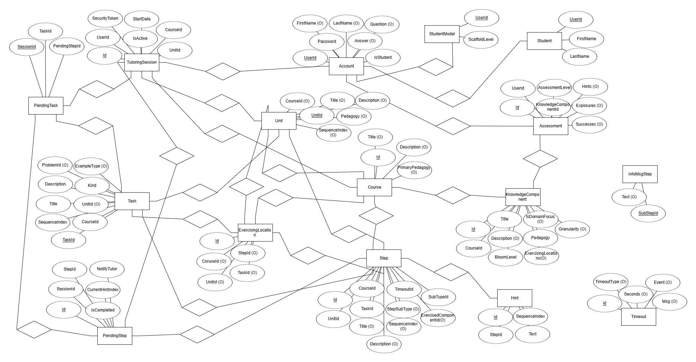

# DpTu - Dynamic Programming Tutor

<!-- Status Badges -->

)

DpTu (Dynamic Programming Tutor) is an Intelligent Tutoring System (ITS) designed to help students learn and practice Dynamic Programming (DP) concepts and algorithms. It provides a step-by-step visual environment for specific DP problems, tracks student progress, and aims to adapt to individual learning needs.

## Features

- User Authentication: Secure account creation and sign-in for students.
- Dynamic Programming Tutoring: Currently focuses on the Longest Common Subsequence (LCS) problem.
- Algorithm Visualization:
  - Step-by-step execution of the DP algorithm.
  - Visual representation of the DP table (SubproblemTableView).
  - Display of algorithm pseudo-code with current line highlighting (CodeView).
  - Visualization of variable values during execution (VariablesView).
  - Visualization of subsequence comparison (SubSequenceView).
- Student Modeling: Tracks student progress on learning outcomes (Knowledge Components).
- Learning Modes: Basic structure for "See One," "Do One," and "Teach One" modes (DashboardPanel).
- Client-Server Architecture: Java Swing GUI client communicates with a Java socket server over JSON.
- Database Persistence: Uses MySQL to store user accounts, course structure, tutoring sessions, and student models.

## Architecture Overview

- Client (GUI): Built using Java Swing (view package). Interacts with the server via svc.SvcFacade.
- Server: A simple Java socket server (svc.DpTuServer) listens for client connections. Each connection is handled by DpTuConnection.
- Tutor Logic: The core tutoring intelligence resides in svc.DpTuTutor, which processes client requests.
- Communication: Client and server exchange JSON messages (svc.ClientRequest, svc.TutorReply) using the Gson library.
- Service Layer: Abstracts business logic and data access (svc package, e.g., AccountSvc, CourseSvc). svc.ServiceFactory provides access to services.
- Data Access Objects (DAOs): Handle database interactions using JDBC (dao package, e.g., AccountDAO, CourseDAO). Extends dao.MySqlDAO for common DB connection logic.
- Model: Represents the application's data structures (model package, e.g., Account, Course, Problem, StudentModel).
- Database: MySQL database stores persistent data.

## Prerequisites

- Java Development Kit (JDK): Version 11 or later recommended.
- MySQL Server: Version 5.7 or 8.x recommended.
- IDE: An IDE like NetBeans (which appears to have been used), Eclipse, or IntelliJ IDEA.
- MySQL JDBC Driver: The project uses com.mysql.cj.jdbc.Driver. Ensure this is included in the project's dependencies.

## Database

In the `documentation` directory, the `DatabaseDiagram.erdplus` file is an Entity Relationship Diagram formatted for the free online tool *ERDPlus* (found at this address: [https://erdplus.com/](https://erdplus.com)). By clicking the top-left `Menu`, one can import this file and make adjustments to the diagram before exporting and committing anew to this project. 

As of 3 May 2025 (end of the Spring 2025 semester), this is the state of the database

This project was developed as part of the CS493_X01 Senior Capstone course.

## Local Development

### Setup

1. Clone the Repository:
   `git clone git@github.com:rblument/DpTuApp.git`
   `cd DpTuApp`

2. Database Setup:
   - Ensure your MySQL server is running (all instructions after this can be accomlished by running the [`setup_DpTuDB.sql`](./database/setup_DpTuDB.sql) script).
   - Create a database (`DpTuDB`).
   - Create a MySQL user (e.g., `DpTu2023`) with privileges on the database.
   - Create the database tables.
   - Populate some initial data.

3. Configure Application:
   - Edit [`DpTu.properties`](./src/main/java/resources/DpTu.properties) file with:
     edu.regis.dptu.DB_HOST=your_mysql_host (likely `localhost`)
     edu.regis.dptu.DB_NAME=your_database_name (if using the script, then `DpTuDB`)
     edu.regis.dptu.DB_USER=your_mysql_user (if using the script, then `DpTuTs`)
     edu.regis.dptu.DB_PASS=your_mysql_password (if using the script, then `DpTu2023`)

4. Build the Project:

   - _Using NetBeans:_
      - Open the project in NetBeans.
      - Use "Build" or "Clean and Build" to compile the code.

   - _In CI/CD or Another IDE:_
      - `mvn compile`

### Running the Application

1. Start the Application:

   - _If using NetBeans:_
      - Run edu.regis.dptu.DpTuApp

   - _Otherwise:_
      - `mvn exec:java -Dexec.mainClass="edu.regis.dptu.DpTuApp"`
      - `find src -name "*.java" | entr -r mvn compile exec:java -Dexec.mainClass="edu.regis.dptu.DpTuApp"` if wanting hot reload

2. Using the GUI:
   - Splash Screen: Choose "Sign In" or "New User".
   - New User: Fill in form on NewAccountPanel and create account.
   - Sign In: Enter User ID and password to access DashboardPanel.
   - Tutoring Session: Select a mode to begin interacting with DP visualizations.

## Usage

- Creating a New Account:
  Run DpTuApp -> Click "New User" -> Fill and submit form.
- Signing In:
  Run DpTuApp -> Enter credentials -> Click "Sign In".
- Running LCS:
  After sign-in, select a mode and use algorithm controls to step through LCS problem.

## Developer Documentation

The following developer guides describe repository standards and CI/CD automation.
All contributors should review these before submitting pull requests.

### Logging Standards

Explains how logging is implemented, required logging patterns, and CI enforcement rules.

📘 [`documentation/logging-developer-guide.md`](./documentation/logging-developer-guide.md)

### GitHub Workflows & Dependency Management

Explains all automated GitHub Actions workflows, CI enforcement, testing pipelines, formatting automation, security scanning, and Dependabot behavior.

📘 [`documentation/workflows-developer-guide.md`](./documentation/workflows-developer-guide.md)

### UI Strings & Localization

Explains why user-facing text should be centralized in message bundles, how the `ResourceMgr` + `Msgs.properties` pattern works, and how to add localized strings safely.

📘 [`documentation/ui-strings-developer-guide.md`](./documentation/ui-strings-developer-guide.md)

These documents define required development practices and are enforced by repository automation.

## Contribution

When contributing, be mindful to format the code before pushing it to GitHub. You can do this by running `mvn spotless:apply`. A plugin defined in [`pom.xml`](./pom.xml) controls the formatting of the project. The formatting keeps the code consistent for others to read, helping code readability and maintenance.

If you forget to format the code, be mindful that a GitHub workflow will do this for you in [`.github/workflows/format-code.yml`](./.github/workflows/format-code.yml). It should only affect you when pushing multiple times without running it.

A future contribution could be how to configure Netbeans to run this automatically in a pre-commit hook (but as of Sept 2025, Netbeans does not support pre-commit hooks). 

## Known Issues

- Incomplete Problem Types: Matrix Chain and 0/1 Knapsack views may be placeholders.
- Limited Tutoring Logic: Adaptation strategies in DpTuTutor may be basic.
- Error Handling: Needs more robust reporting for database/network issues.
- Save Session: Menu option unimplemented.
- Step Feedback: Answer checking and feedback mechanisms may be incomplete.
- Database Schema: A SQL script should be created for future setup.
- Hardcoded Values: Consider moving defaults to configuration files.

## License

(C) 2019-2026 Johanna and Richard Blumenthal. All Rights Reserved.
Unauthorized use, duplication or distribution without the authors' permission is strictly prohibited.
This software is distributed on an "AS IS" basis without warranties or conditions of any kind, either expressed or implied.
